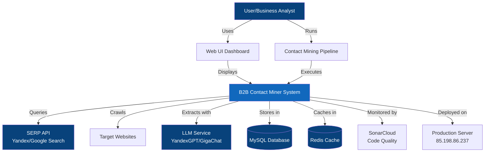
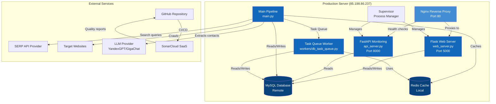
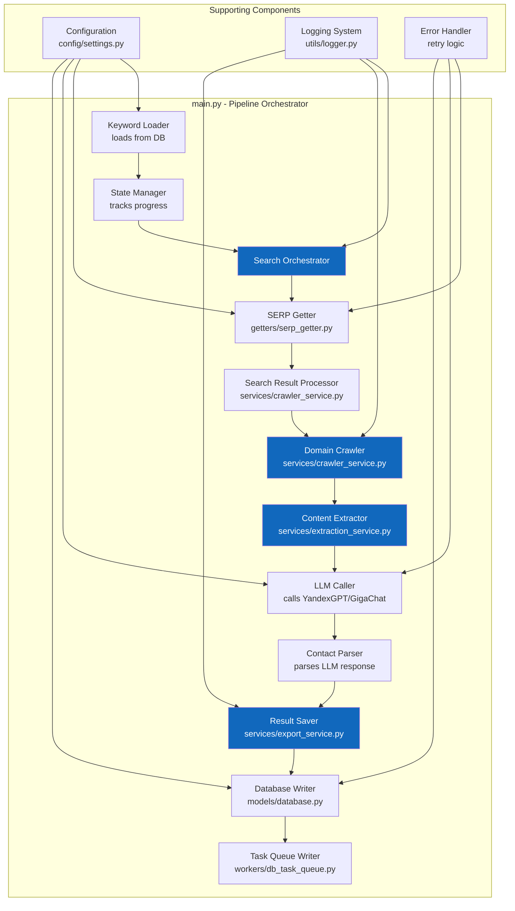
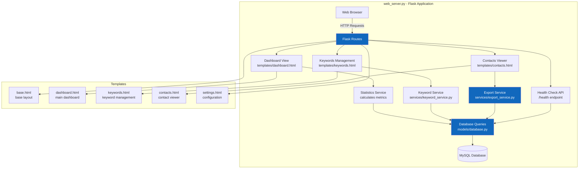
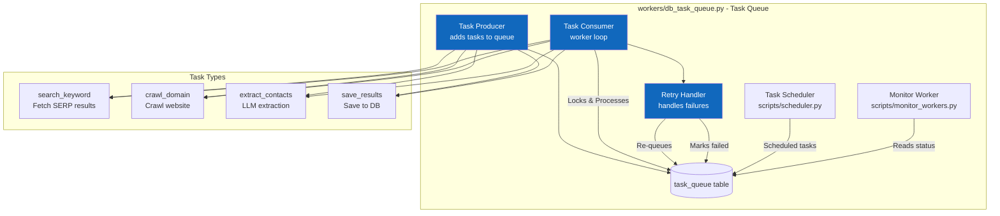
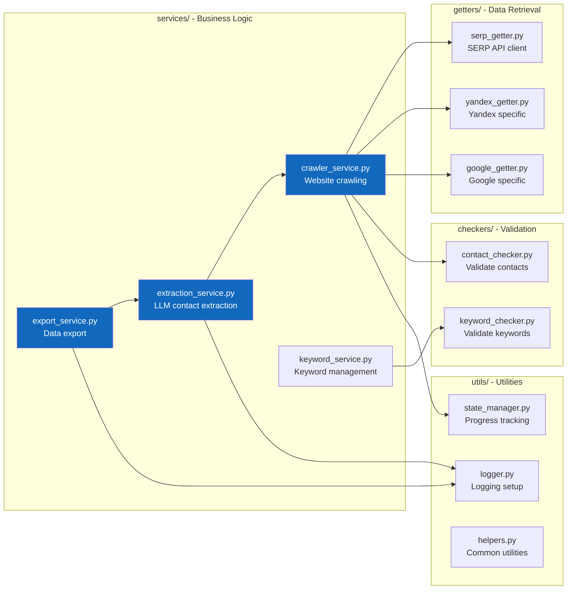
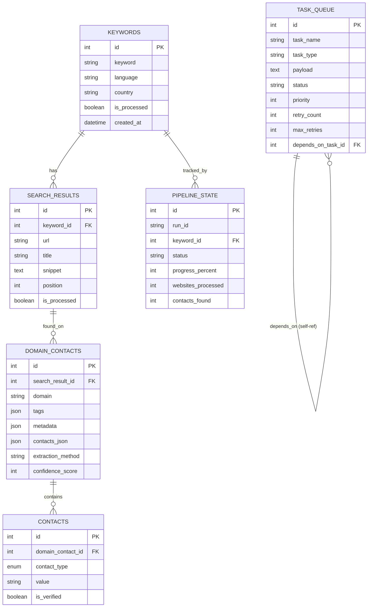
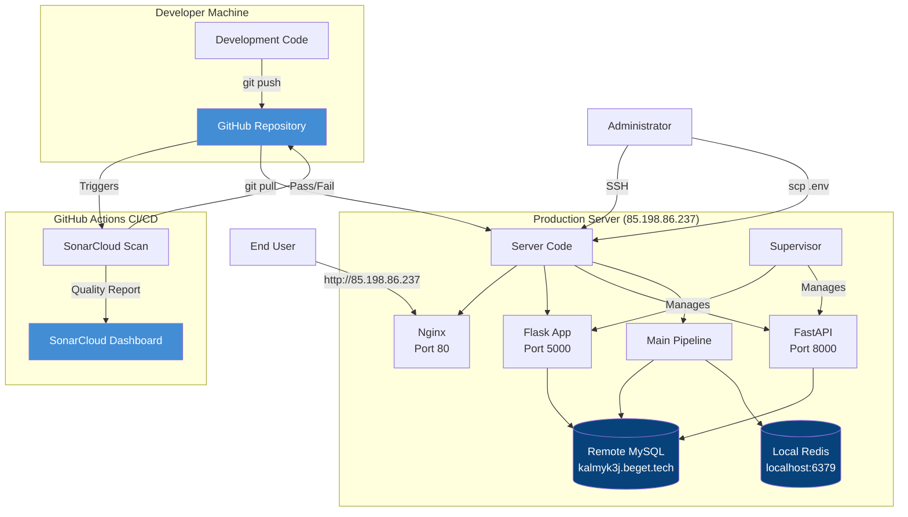

# C4 Architecture Diagrams - B2B Contact Miner

## Level 1: System Context Diagram

**Description:** The B2B Contact Miner system helps users discover business contacts by searching for keywords, crawling websites, and extracting contact information using AI.

---

## Level 2: Container Diagram

**Containers:**
1. **Nginx** - Reverse proxy for secure external access
2. **Flask Web Server** - User interface for viewing results
3. **FastAPI Monitoring** - Health check and metrics API
4. **Main Pipeline** - Core contact mining orchestrator
5. **Task Queue Worker** - Async task processing
6. **MySQL Database** - Persistent data storage
7. **Redis Cache** - Temporary caching and rate limiting

---

## Level 3: Component Diagram - Main Pipeline

**Key Components:**
1. **Keyword Loader** - Loads unprocessed keywords from database
2. **Search Orchestrator** - Coordinates search → crawl → extract pipeline
3. **SERP Getter** - Fetches search results from SERP API
4. **Domain Crawler** - Crawls websites using Playwright
5. **Content Extractor** - Uses LLM to extract contacts from HTML
6. **Result Saver** - Saves extracted contacts to database
7. **Task Queue Writer** - Creates async tasks for processing

---

## Level 3: Component Diagram - Web UI

**Key Components:**
1. **Flask Routes** - HTTP request handlers
2. **Dashboard View** - Shows statistics and pipeline status
3. **Keywords Management** - Add/edit/search keywords
4. **Contacts Viewer** - Browse and filter extracted contacts
5. **Export Service** - Export contacts to CSV/Excel
6. **Health Check** - System health monitoring endpoint

---

## Level 3: Component Diagram - Task Queue System

**Key Components:**
1. **Task Producer** - Creates tasks when pipeline runs
2. **Task Consumer** - Worker that processes tasks from queue
3. **Retry Handler** - Implements retry logic with exponential backoff
4. **Task Scheduler** - Schedules recurring tasks
5. **Monitor Worker** - Monitors queue health and stuck tasks

---

## Level 4: Code Structure - Services Layer

---

## Database Schema Overview

---

## Deployment Architecture

---

## Key Design Decisions

### 1. Database Choice
- **MySQL** for persistent storage (relational data, ACID compliance)
- **Redis** for caching and rate limiting (fast key-value store)

### 2. Task Queue
- **Database-backed queue** instead of Redis/RabbitMQ
- Pros: Persistence, no extra infrastructure, easy monitoring
- Cons: Slower than message brokers, but acceptable for this use case

### 3. LLM Integration
- **Multiple providers** (YandexGPT, GigaChat) for redundancy
- **Fallback mechanism** if one provider fails

### 4. Web Framework
- **Flask** for UI (simple, lightweight, Jinja2 templates)
- **FastAPI** for monitoring API (async, auto-generated docs)

### 5. Deployment
- **Nginx reverse proxy** for security and performance
- **Supervisor** for process management
- **SSH + Git** for deployment (simple, no Docker overhead)

### 6. Code Quality
- **SonarCloud** for continuous code quality monitoring
- **GitHub Actions** for automated analysis on every push

---

## Technology Stack Summary

| Layer | Technology | Purpose |
|-------|-----------|---------|
| **Frontend** | HTML/CSS/JS + Jinja2 | Web UI templates |
| **Backend Web** | Flask 3.x | Web application framework |
| **Backend API** | FastAPI | Monitoring and health check API |
| **Database** | MySQL 8.x | Primary data storage |
| **Cache** | Redis 7.x | Caching and rate limiting |
| **Browser Automation** | Playwright | Website crawling |
| **AI/ML** | YandexGPT, GigaChat | Contact extraction from HTML |
| **Task Queue** | Custom DB-based | Async task processing |
| **Web Server** | Nginx | Reverse proxy |
| **Process Manager** | Supervisor | Process supervision |
| **CI/CD** | GitHub Actions | Automated testing and analysis |
| **Code Quality** | SonarCloud | Static code analysis |
| **Deployment** | SSH + Git | Manual deployment |

---

## Security Considerations

1. **Network Security**
   - Flask binds to localhost only (127.0.0.1)
   - Nginx provides external access with security headers
   - SSH key authentication for server access

2. **Data Security**
   - `.env` file not committed to Git
   - Database credentials in environment variables
   - SonarCloud token stored securely

3. **Application Security**
   - Input validation on all user inputs
   - SQL injection prevention (SQLAlchemy ORM)
   - XSS protection (security headers)

4. **Monitoring**
   - Health check endpoints
   - Error logging
   - SonarCloud vulnerability scanning
