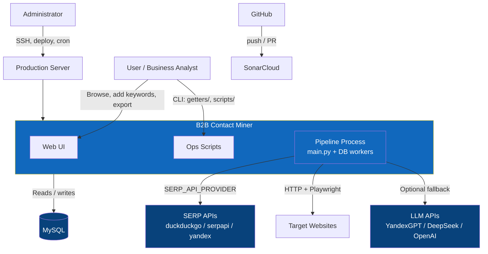
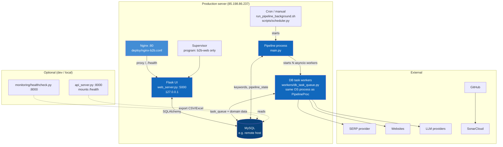
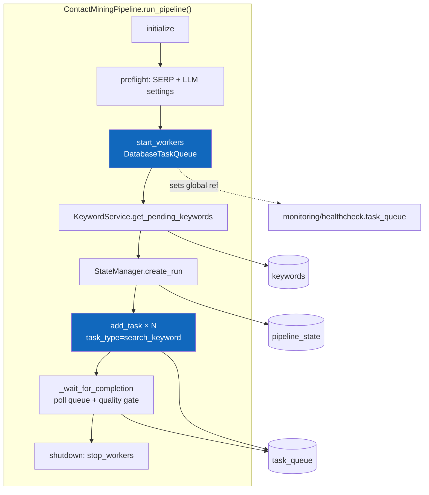
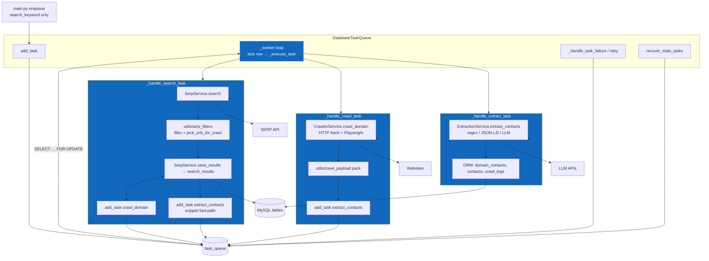
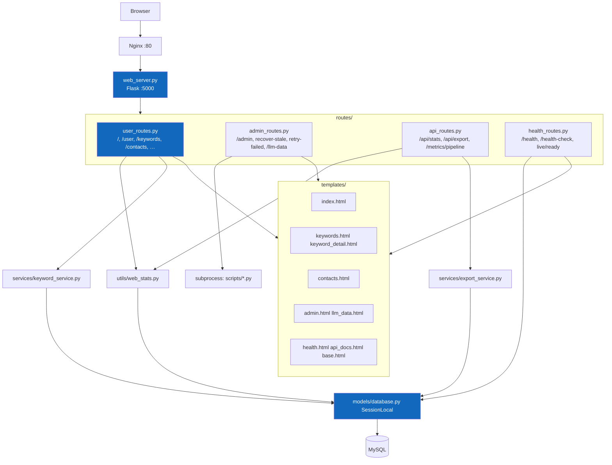
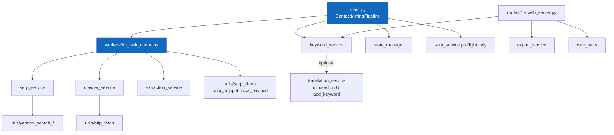
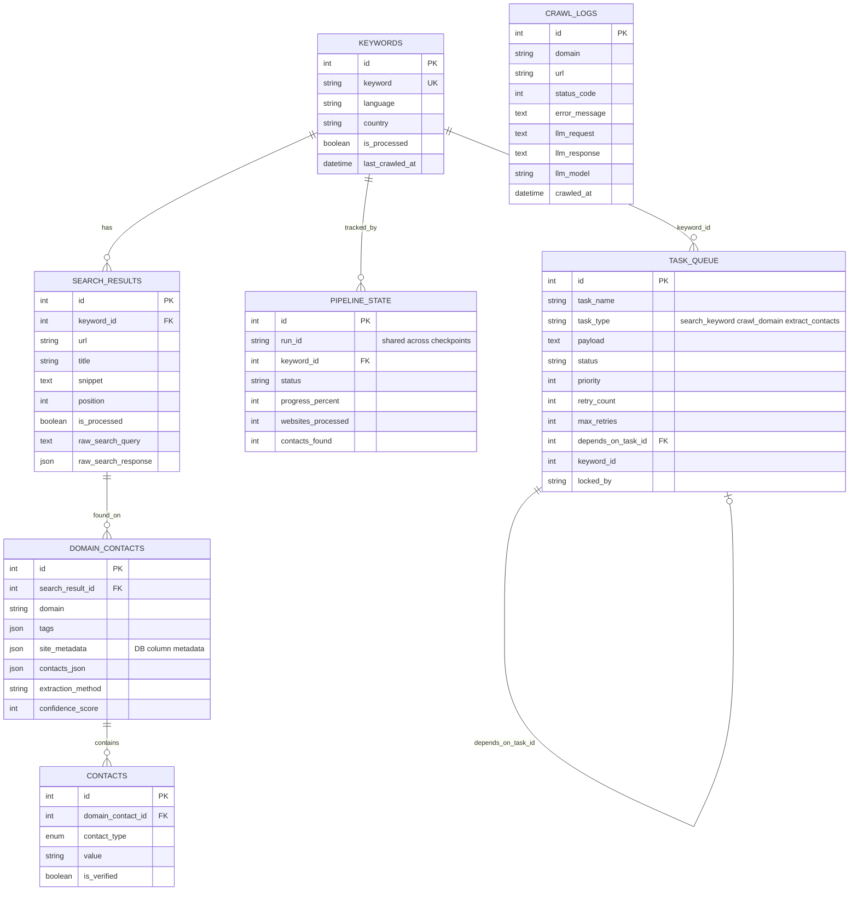

# C4 Architecture Diagrams - B2B Contact Miner

> Aligned with current code (DB task queue, `run_pipeline()` orchestrator, Flask `routes/`).  
> Narrative flow: [HOW_IT_WORKS.md](HOW_IT_WORKS.md), [TASK_QUEUE.md](TASK_QUEUE.md).

---

## Level 1: System Context Diagram

```mermaid
graph TB
    User[User / Business Analyst]
    Admin[Administrator]

    User -->|Browse, add keywords, export| WebUI[Web UI]
    User -->|CLI: getters/, scripts/| OpsScripts[Ops Scripts]
    Admin -->|SSH, deploy, cron| Server[Production Server]

    subgraph System[B2B Contact Miner]
        WebUI
        OpsScripts
        Pipeline[Pipeline Process<br/>main.py + DB workers]
    end

    Pipeline -->|SERP_API_PROVIDER| SERP[SERP APIs<br/>duckduckgo / serpapi / yandex]
    Pipeline -->|HTTP + Playwright| Websites[Target Websites]
    Pipeline -->|Optional fallback| LLM[LLM APIs<br/>YandexGPT / DeepSeek / OpenAI]

    System -->|Reads / writes| MySQL[(MySQL)]
    GitHub[GitHub] -->|push / PR| SonarCloud[SonarCloud]
    Server --> System

    style System fill:#1168bd,color:#fff
    style Pipeline fill:#1168bd,color:#fff
    style MySQL fill:#08427b,color:#fff
    style SERP fill:#08427b,color:#fff
    style LLM fill:#08427b,color:#fff
```

**Description:** Users manage keywords and view contacts via Flask. Mining runs as `python main.py` (or cron / `scripts/run_pipeline_background.sh`): one process enqueues `search_keyword` tasks and runs `DatabaseTaskQueue` workers that call SERP, crawl sites, and extract contacts into MySQL.

---

## Level 2: Container Diagram

```mermaid
graph TB
    subgraph Prod["Production server (85.198.86.237)"]
        Nginx[Nginx :80<br/>deploy/nginx-b2b.conf]
        Flask[Flask UI<br/>web_server.py :5000<br/>127.0.0.1]
        PipelineProc[Pipeline process<br/>main.py]
        Workers[DB task workers<br/>workers/db_task_queue.py<br/>same OS process as PipelineProc]
        Supervisor[Supervisor<br/>program: b2b-web only]
        Cron[Cron / manual<br/>run_pipeline_background.sh<br/>scripts/scheduler.py]

        Nginx -->|proxy /, /health| Flask
        Supervisor --> Flask
        Cron -->|starts| PipelineProc
        PipelineProc -->|starts N asyncio workers| Workers
        Flask <-->|SQLAlchemy| MySQL[(MySQL<br/>e.g. remote host)]
        Workers <-->|task_queue + domain data| MySQL
        PipelineProc <-->|keywords, pipeline_state| MySQL
    end

    subgraph DevOptional["Optional (dev / local)"]
        HealthAPI[monitoring/healthcheck.py :8000]
        ExportAPI[api_server.py :8000<br/>mounts /health]
    end

    subgraph External["External"]
        SERP[SERP provider]
        Sites[Websites]
        LLM[LLM providers]
        GH[GitHub]
        SC[SonarCloud]
    end

    Workers --> SERP
    Workers --> Sites
    Workers --> LLM
    HealthAPI -.->|reads| MySQL
    ExportAPI -.->|export CSV/Excel| MySQL
    GH --> SC

    style Flask fill:#1168bd,color:#fff
    style PipelineProc fill:#1168bd,color:#fff
    style Workers fill:#1168bd,color:#fff
    style MySQL fill:#08427b,color:#fff
    style Nginx fill:#438dd5,color:#fff
```

**Containers:**

| Container | Role |
|-----------|------|
| **Nginx** | Public HTTP; proxies to Flask only (no `:8000` in prod nginx config) |
| **Flask UI** | Keywords, contacts, admin actions, `/health` (DB ping) |
| **Pipeline process** | `ContactMiningPipeline.run_pipeline()` — preflight, enqueue searches, wait for queue |
| **DB task workers** | In-process asyncio pool (`MAX_CONCURRENT_DOMAINS`, default 12); handlers call services |
| **MySQL** | `keywords`, `search_results`, `domain_contacts`, `contacts`, `task_queue`, `pipeline_state`, `crawl_logs`, … |
| **Health / export API** | Optional localhost; `api_server.py` proxies `/metrics/pipeline` from Flask when monitoring is up |

Legacy sync path `_process_keyword()` in `main.py` is **not** used by `run_pipeline()` (only `getters/run_specific_keyword.py`).

---

## Level 3: Component Diagram — Pipeline orchestrator (`main.py`)

```mermaid
flowchart TB
    subgraph Run["ContactMiningPipeline.run_pipeline()"]
        Init[initialize]
        Preflight[preflight: SERP + LLM settings]
        StartQ[start_workers<br/>DatabaseTaskQueue]
        LoadKW[KeywordService.get_pending_keywords]
        CreateRun[StateManager.create_run]
        Enqueue[add_task × N<br/>task_type=search_keyword]
        Wait[_wait_for_completion<br/>poll queue + quality gate]
        Shutdown[shutdown: stop_workers]
    end

    Init --> Preflight --> StartQ
    StartQ --> LoadKW --> CreateRun --> Enqueue --> Wait --> Shutdown

    Enqueue --> TQ[(task_queue)]
    Wait --> TQ
    LoadKW --> KW[(keywords)]
    CreateRun --> PS[(pipeline_state)]

    StartQ -.->|sets global ref| HC[monitoring/healthcheck.task_queue]

    style Enqueue fill:#1168bd,color:#fff
    style StartQ fill:#1168bd,color:#fff
```

**Orchestrator responsibilities:** load pending keywords, create run id, enqueue **only** `search_keyword` tasks, monitor completion (default 2h timeout). All SERP/crawl/extract work happens in queue handlers (next diagram).

---

## Level 3: Component Diagram — Task queue (`workers/db_task_queue.py`)

```mermaid
flowchart TB
    subgraph Queue["DatabaseTaskQueue"]
        Add[add_task]
        Worker[_worker loop<br/>lock row → _execute_task]
        Retry[_handle_task_failure / retry]
        Recover[recover_stale_tasks]
    end

    TQ[(task_queue)]

    Add --> TQ
    Worker <-->|SELECT … FOR UPDATE| TQ
    Retry --> TQ
    Recover --> TQ

    subgraph HSearch["_handle_search_task"]
        Serp[SerpService.search]
        Filters[utils/serp_filters<br/>filter + pick_urls_for_crawl]
        SaveSERP[SerpService.save_results → search_results]
        EnqCrawl[add_task crawl_domain]
        EnqExtract[add_task extract_contacts<br/>snippet fast-path]
    end

    subgraph HCrawl["_handle_crawl_task"]
        Crawl[CrawlerService.crawl_domain<br/>HTTP fetch + Playwright]
        Pack[utils/crawl_payload pack]
        EnqExt2[add_task extract_contacts]
    end

    subgraph HExtract["_handle_extract_task"]
        Ext[ExtractionService.extract_contacts<br/>regex / JSON-LD / LLM]
        Persist[ORM: domain_contacts, contacts, crawl_logs]
    end

    Worker --> HSearch
    Worker --> HCrawl
    Worker --> HExtract

    HSearch --> Serp --> Filters --> SaveSERP --> EnqCrawl
    SaveSERP --> EnqExtract
    HCrawl --> Crawl --> Pack --> EnqExt2
    HExtract --> Ext --> Persist

    Serp --> SERPExt[SERP API]
    Crawl --> WebExt[Websites]
    Ext --> LLMExt[LLM APIs]

    Persist --> DB[(MySQL tables)]
    SaveSERP --> DB
    EnqCrawl --> TQ
    EnqExtract --> TQ
    EnqExt2 --> TQ

    MainEnqueue[main.py enqueue<br/>search_keyword only] --> Add

    style Worker fill:#1168bd,color:#fff
    style HSearch fill:#1168bd,color:#fff
    style HCrawl fill:#1168bd,color:#fff
    style HExtract fill:#1168bd,color:#fff
```

**Task types (handlers implemented):**

| `task_type` | Producer | Handler outcome |
|-------------|----------|-----------------|
| `search_keyword` | `main.py` | SERP → save `search_results` → enqueue `crawl_domain` / `extract_contacts` |
| `crawl_domain` | search handler | Crawl → enqueue `extract_contacts` with packed content |
| `extract_contacts` | search / crawl | Extract → save contacts; may re-crawl if payload empty |

`save_results` exists in schema/comments and retry map but has **no** worker handler (SERP persist is inside `search_keyword`).

**Ops (read-only on queue):** `scripts/monitor_workers.py`, `scripts/recover_stale_tasks.py`, `scripts/unblock_orphan_queue_tasks.py`.

**Scheduler:** `scripts/scheduler.py` runs `asyncio.run(pipeline.run_pipeline())` daily — not per-row inserts into `task_queue`.

---

## Level 3: Component Diagram — Web UI

```mermaid
graph TB
    Browser[Browser] --> Nginx[Nginx :80]
    Nginx --> FlaskApp[web_server.py<br/>Flask :5000]

    subgraph Routes["routes/"]
        UserR[user_routes.py<br/>/, /user, /keywords, /contacts, …]
        AdminR[admin_routes.py<br/>/admin, recover-stale, retry-failed, /llm-data]
        ApiR[api_routes.py<br/>/api/stats, /api/export, /metrics/pipeline]
        HealthR[health_routes.py<br/>/health, /health-check, live/ready]
    end

    FlaskApp --> Routes

    UserR --> WebStats[utils/web_stats.py]
    UserR --> KWsvc[services/keyword_service.py]
    ApiR --> WebStats
    ApiR --> ExportSvc[services/export_service.py]
    AdminR --> Scripts[subprocess: scripts/*.py]

    WebStats --> ORM[models/database.py SessionLocal]
    KWsvc --> ORM
    ExportSvc --> ORM
    HealthR --> ORM

    ORM --> MySQL[(MySQL)]

    subgraph Templates["templates/"]
        T1[index.html]
        T2[keywords.html keyword_detail.html]
        T3[contacts.html]
        T4[admin.html llm_data.html]
        T5[health.html api_docs.html base.html]
    end

    UserR --> Templates
    AdminR --> Templates
    HealthR --> Templates

    style FlaskApp fill:#1168bd,color:#fff
    style UserR fill:#1168bd,color:#fff
    style ORM fill:#1168bd,color:#fff
```

**Notes:** CSRF via `utils/web_security.py`. `/metrics/pipeline` may call `http://127.0.0.1:8000` when `monitoring/healthcheck` is running. Export for UI uses `ExportService`; pipeline writes contacts inside task handlers (not `ExportService`).

---

## Level 4: Runtime dependencies (services & orchestration)

```mermaid
graph TB
    Main[main.py<br/>ContactMiningPipeline]
    Queue[workers/db_task_queue.py]
    Web[routes/* + web_server.py]

    Main --> Queue
    Main --> KW[keyword_service]
    Main --> SM[state_manager]
    Main --> SerpP[serp_service preflight only]

    Queue --> Serp[serp_service]
    Queue --> Crawl[crawler_service]
    Queue --> Ext[extraction_service]
    Queue --> SF[utils/serp_filters<br/>serp_snippet crawl_payload]

    Web --> KW
    Web --> Exp[export_service]
    Web --> WS[web_stats]

    KW -.->|optional| Trans[translation_service<br/>not used on UI add_keyword]

    Crawl --> HF[utils/http_fetch]
    Serp --> YX[utils/yandex_search_*]

    style Queue fill:#1168bd,color:#fff
    style Main fill:#1168bd,color:#fff
```

Arrows: **uses** (runtime). `ExportService` is not on the hot pipeline path.

---

## Database schema overview

```mermaid
erDiagram
    KEYWORDS ||--o{ SEARCH_RESULTS : has
    SEARCH_RESULTS ||--o{ DOMAIN_CONTACTS : found_on
    DOMAIN_CONTACTS ||--o{ CONTACTS : contains
    KEYWORDS ||--o{ PIPELINE_STATE : tracked_by
    KEYWORDS ||--o{ TASK_QUEUE : "keyword_id"
    TASK_QUEUE ||--o| TASK_QUEUE : depends_on_task_id

    KEYWORDS {
        int id PK
        string keyword UK
        string language
        string country
        boolean is_processed
        datetime last_crawled_at
    }

    SEARCH_RESULTS {
        int id PK
        int keyword_id FK
        string url
        string title
        text snippet
        int position
        boolean is_processed
        text raw_search_query
        json raw_search_response
    }

    DOMAIN_CONTACTS {
        int id PK
        int search_result_id FK
        string domain
        json tags
        json site_metadata "DB column metadata"
        json contacts_json
        string extraction_method
        int confidence_score
    }

    CONTACTS {
        int id PK
        int domain_contact_id FK
        enum contact_type
        string value
        boolean is_verified
    }

    PIPELINE_STATE {
        int id PK
        string run_id "shared across checkpoints"
        int keyword_id FK
        string status
        int progress_percent
        int websites_processed
        int contacts_found
    }

    TASK_QUEUE {
        int id PK
        string task_name
        string task_type "search_keyword crawl_domain extract_contacts"
        text payload
        string status
        int priority
        int retry_count
        int max_retries
        int depends_on_task_id FK
        int keyword_id
        string locked_by
    }

    CRAWL_LOGS {
        int id PK
        string domain
        string url
        int status_code
        text error_message
        text llm_request
        text llm_response
        string llm_model
        datetime crawled_at
    }
```

---

## Deployment architecture

```mermaid
graph TB
    Dev[Developer] -->|git push| GH[GitHub]
    GH --> GHA[GitHub Actions<br/>sonarcloud.yml]
    GHA --> SC[SonarCloud]

    Admin[Administrator] -->|SSH git pull| Code[/opt/b2b-contact-miner]
    Admin -->|.env| Code

    Code --> Nginx[Nginx :80]
    Code --> Flask[Flask :5000<br/>supervisor b2b-web]
    Code --> Pipe[Pipeline<br/>cron 02:00 or<br/>run_pipeline_background.sh]

    Pipe --> MySQL[(Remote MySQL)]
    Flask --> MySQL

    User[End user] -->|http://85.198.86.237| Nginx

    subgraph DevLocal["Local / dev optional"]
        FAPI[uvicorn healthcheck or api_server :8000]
    end

    FAPI -.-> MySQL

    style GH fill:#438dd5,color:#fff
    style SC fill:#438dd5,color:#fff
    style MySQL fill:#08427b,color:#fff
```

**Prod maintenance (cron):** `scripts/weekly_maintenance.sh` — quality report, SERP denylist, orphan queue fix, MySQL id repair.

---

## Key design decisions

### 1. Database
- **MySQL** for data and **task queue** (`task_queue` table); Docker example: `mysql:8.0` in `doc/docker-compose.yml`.

### 2. Async processing
- **In-process** `DatabaseTaskQueue` (no Redis); worker count = `MAX_CONCURRENT_DOMAINS` (default **12**).
- **Orchestrator** only enqueues `search_keyword`; handlers chain crawl/extract tasks.

### 3. SERP
- Single active provider via `SERP_API_PROVIDER`: `duckduckgo` | `serpapi` | `yandex` (prod CIS typically `yandex`).

### 4. Extraction
- Regex / JSON-LD / mailto first; **LLM fallback** when `USE_LLM_EXTRACTION` and provider keys are set.

### 5. Web vs pipeline
- **Flask** + `routes/` for UI; **ExportService** for downloads only.
- **Pipeline** persists contacts in `db_task_queue` handlers.

### 6. Deployment
- **Nginx** → Flask; **Supervisor** manages web only (`deploy/deploy.sh`).
- **Pipeline** via cron / background script, not supervisord in default deploy.

### 7. Quality
- **SonarCloud** on every push/PR (`.github/workflows/sonarcloud.yml`).

---

## Technology stack summary

| Layer | Technology | Purpose |
|-------|-----------|---------|
| **UI** | Flask 3 + Jinja2 templates | Dashboard, keywords, contacts, admin |
| **Pipeline** | `asyncio` + `main.py` | Enqueue and supervise runs |
| **Workers** | `workers/db_task_queue.py` | SERP / crawl / extract handlers |
| **Database** | MySQL + SQLAlchemy | Storage + queue |
| **Crawl** | `utils/http_fetch` + Playwright | HTTP-first, browser fallback |
| **SERP** | DuckDuckGo / SerpAPI / Yandex Search API | Config-driven |
| **LLM** | YandexGPT, DeepSeek, OpenAI | Optional extraction fallback |
| **Proxy** | Nginx | Public access to Flask |
| **Process mgr** | Supervisor | `b2b-web` (Flask) on prod |
| **CI** | GitHub Actions + SonarCloud | Static analysis |

---

## Security considerations

1. **Network:** Flask on `127.0.0.1`; Nginx terminates public HTTP with security headers (`deploy/nginx-b2b.conf`).
2. **Secrets:** `.env` not in git; DB and API keys from environment.
3. **App:** CSRF on mutating routes; SQLAlchemy ORM; keyword text sanitization in `user_routes.py`.
4. **Monitoring:** Flask `/health`; optional FastAPI health app when pipeline sets `healthcheck.task_queue`.

---

## Related docs

- [HOW_IT_WORKS.md](HOW_IT_WORKS.md) — step-by-step pipeline
- [TASK_QUEUE.md](TASK_QUEUE.md) — queue operations
- [DATABASE_SCHEMA.md](DATABASE_SCHEMA.md) — full schema reference
- [DEPLOYMENT_GUIDE.md](DEPLOYMENT_GUIDE.md) — server setup
