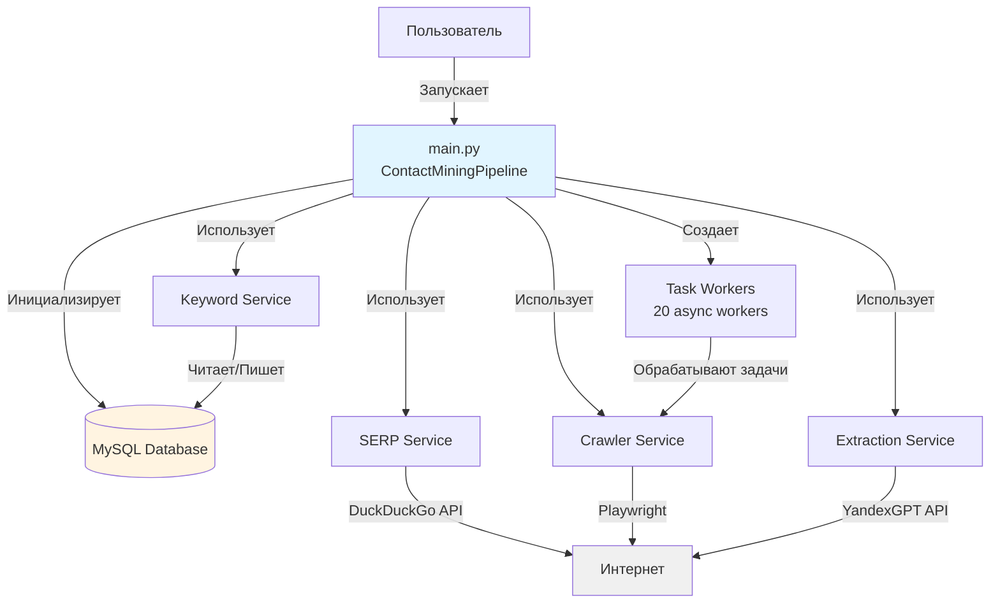
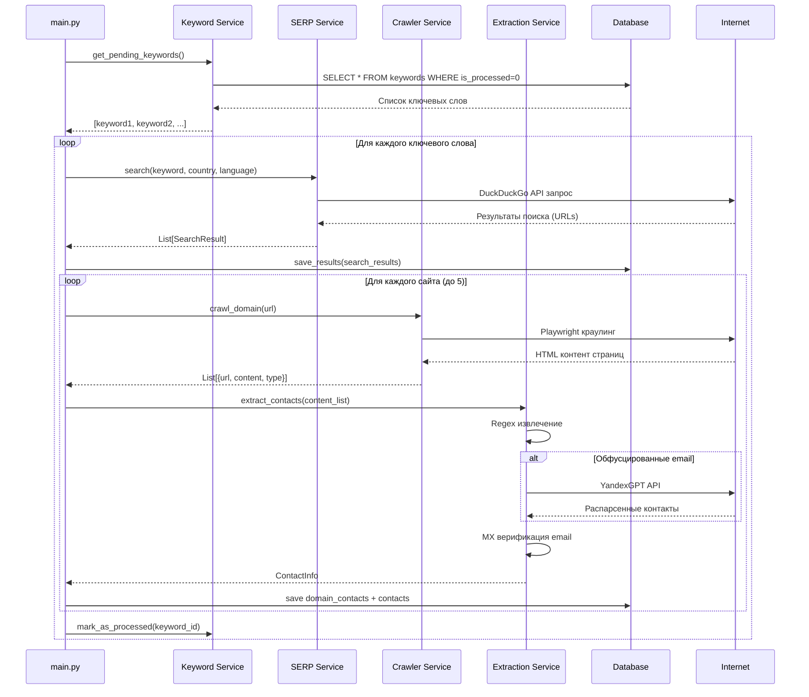
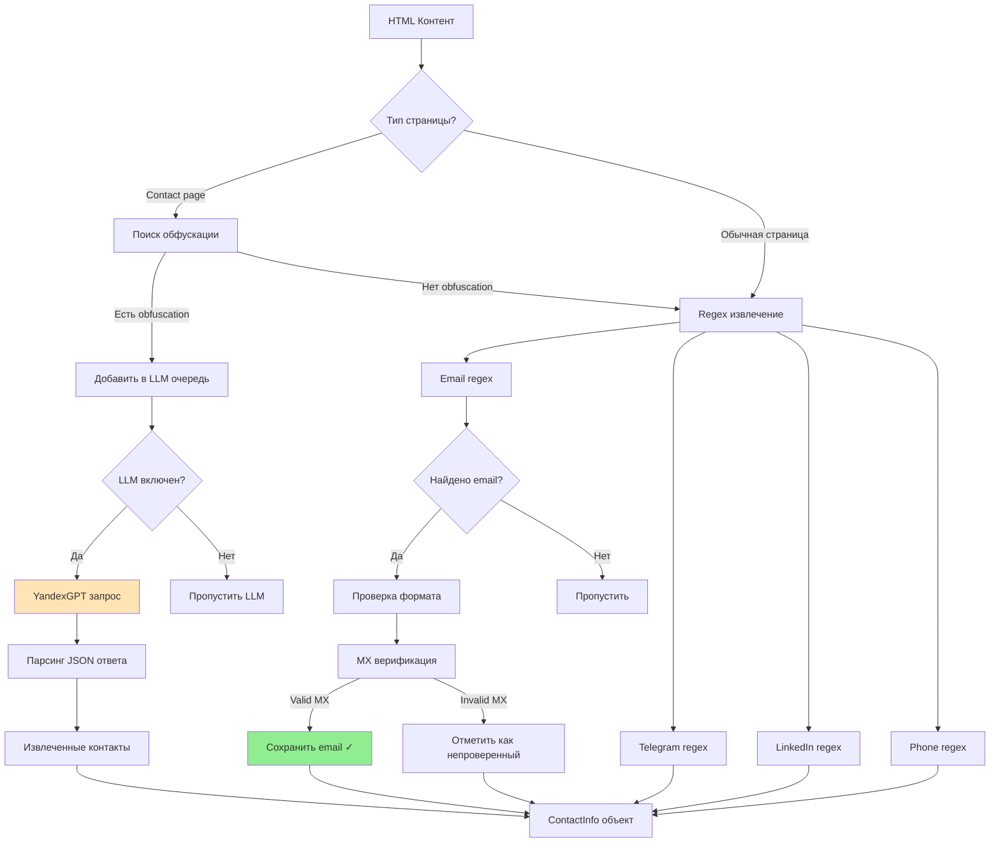
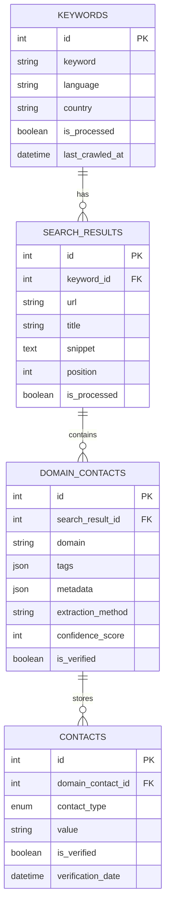
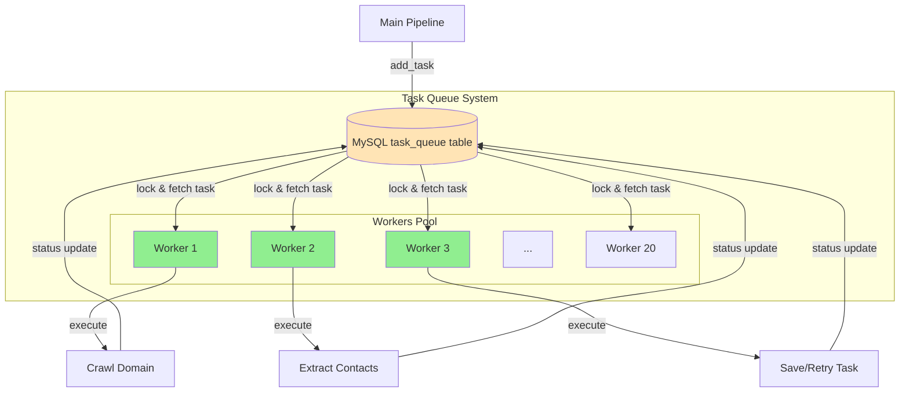
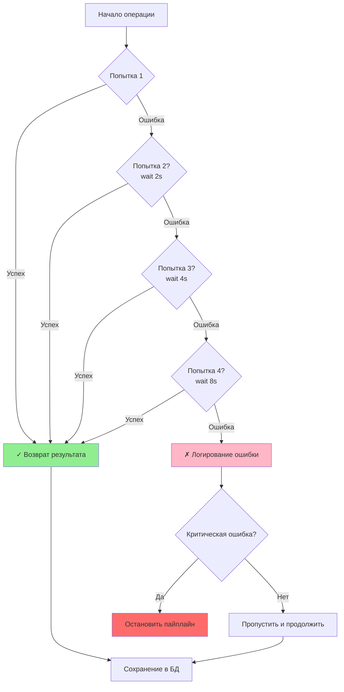
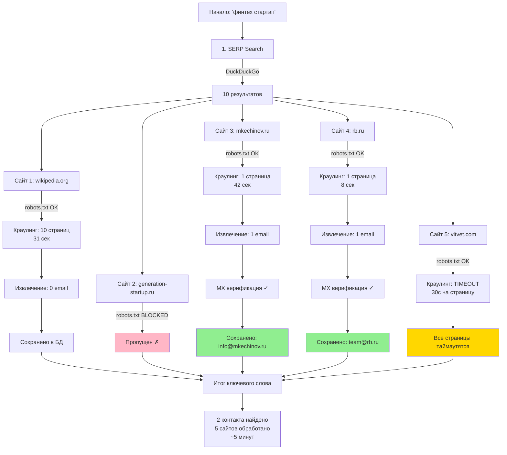
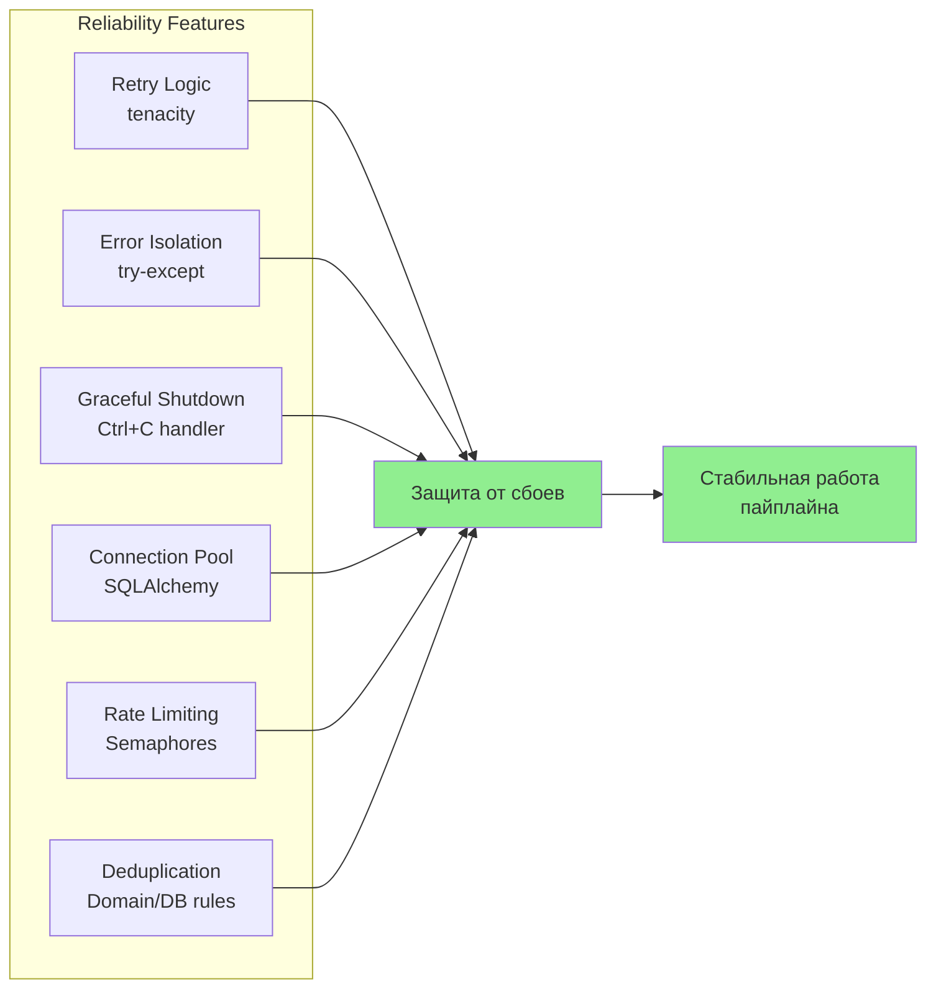
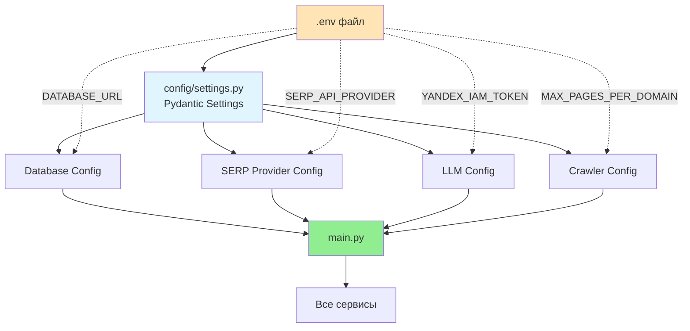

# 📊 Диаграммы взаимодействия модулей

## 1. Общая архитектура системы



---

## 2. Поток выполнения пайплайна



---

## 3. Взаимодействие сервисов при краулинге

```mermaid
graph LR
    A[Crawler Service] -->|1. Проверка| B{Robots.txt}
    B -->|Заблокировано| C[Пропустить домен]
    B -->|Разрешено| D[2. Запуск Playwright]
    
    D -->|3. Загрузка| E[Sitemap.xml]
    E -->|Есть sitemap| F[Извлечь URLs]
    E -->|Нет sitemap| G[Парсинг главной страницы]
    
    F --> H[4. Приоритизация URL]
    G --> H
    
    H -->|Высокий приоритет| I[/contact, /contacts]
    H -->|Средний приоритет| J[/about, /team]
    H -->|Низкий приоритет| K[Остальные страницы]
    
    I --> L[5. Краулинг страниц]
    J --> L
    K --> L
    
    L -->|Таймаут 30с| M{Успех?}
    L -->|Успех| M
    
    M -->|Контакты найдены| N[Ранняя остановка ✓]
    M -->|10 страниц| O[Достигнут лимит]
    M -->|Нет контактов| P[Продолжить]
    
    N --> Q[Возврат контента]
    O --> Q
    P --> Q
    
    style N fill:#90EE90
    style C fill:#FFB6C6
```

---

## 4. Извлечение контактов (Extraction Pipeline)



---

## 5. База данных - схема отношений



---

## 6. Асинхронная очередь задач



---

## 7. Retry механизм и обработка ошибок



---

## 8. Пример полного цикла обработки одного ключевого слова



---

## 9. Компоненты надежности



---

## 10. Конфигурация и настройка



---

Эти диаграммы показывают, как все модули взаимодействуют друг с другом для выполнения задачи поиска и извлечения контактной информации!
